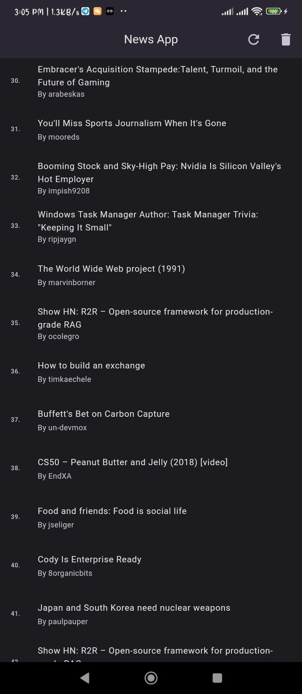
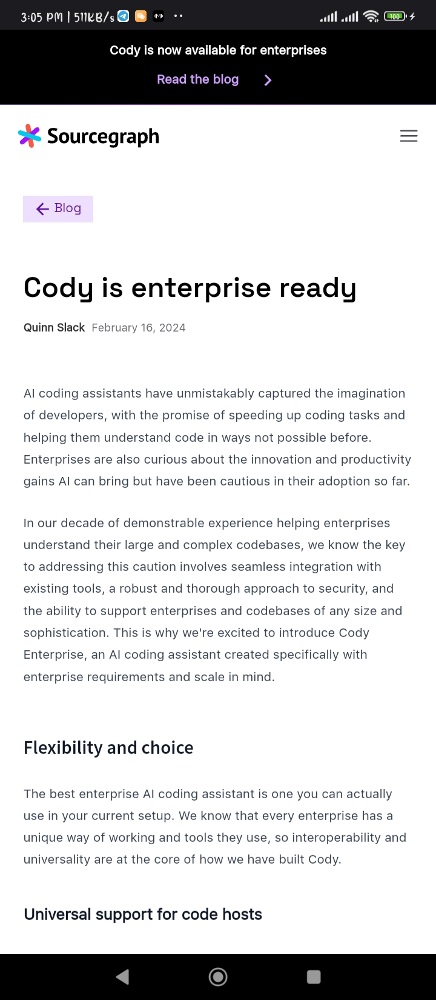

 
  

&#xa0;

  <!-- <a href="https://e_commerce_app_flutter.netlify.app">Demo</a> -->

<h1 align="center">News App: Flutter News App</h1>

  

  

  

  

  <!-- 

  

   -->

  <a href="#dart-about">About</a> &#xa0; | &#xa0; 
  <a href="#sparkles-features">Features</a> &#xa0; | &#xa0;
  <a href="#checkered_flag-illustrations">Illustrations</a> &#xa0; | &#xa0;
  <a href="#white_check_mark-installation">Installation</a> &#xa0; | &#xa0;
  <a href="#rocket-resources">Resources</a> &#xa0; | &#xa0;
  <a href="https://github.com/makuochukwu225" target="_blank">Author</a>

 

## About

This is a news App using REST API. The news article is cached for offline for later use.
## Features

:heavy_check_mark: See Latest News\
:heavy_check_mark: View them on the App

## Illustrations

Here are some Illustration of App Screens

|  |  |
|:--------------------------------:|:-------------------------------:|
|           Home Screen            |           Web Screen            | 

## Resources

The following Resources were used in this project:

- [Flutter Official Docs](https://flutter.dev/docs)
- [Flutter Community Medium](https://medium.com/flutter-community)
- [Stack Overflow: Flutter](https://stackoverflow.com/questions/tagged/flutter)
- [UI Inspiration](https://github.com/abuanwar072/E-commerce-Complete-Flutter-UI)
- [Icons](https://www.flaticon.com/)